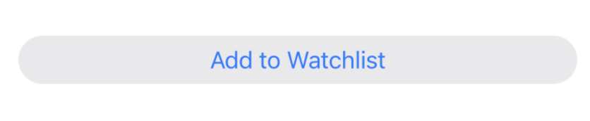

# Customizing Buttons in SwiftUI

Buttons are an important part of any iOS application and in iOS 15, SwiftUI introduces several different ways to implement and customize buttons views. In this article we are going to learn about all the new ways you can customize your buttons.

Let’s get started…

### Rounded Corners

In the previous version of iOS, if we had to create a nice looking large rounded corners button then we may have to write the following code:

``` swift
 Button {
           // action
            } label: {
                Text("Add to Watchlist").frame(maxWidth: 400)
                    .padding()
                    .foregroundColor(.white)
            }.background(.teal)
                .clipShape(RoundedRectangle(cornerRadius: 10, style: .continuous))
```

The result is shown below:


In iOS 15, if we have to write the same button then we can implement it using the following code:

``` swift
Button {
        } label: {
        Text("Add to Watchlist").frame(maxWidth: 400)
    }.buttonStyle(.bordered)
```

The result is shown below:



The new **.bordered** buttonStyle automatically makes the button with rounded corners automatically. If we had to add some background color then we can use the **.tint** modifier along with the **.controlProminence** modifier as shown below:

``` swift 
Button {
                // code
            } label: {
                Text("Add to Watchlist").frame(maxWidth: 400)
                    .foregroundColor(.white)
            }
            .buttonStyle(.bordered)
            .tint(.teal) // set the tint
            .controlSize(.large)
            .controlProminence(.increased) // increase the prominence
```

The result is shown below:


By setting the value of controlProminence to .increased we are conveying that this button is important and represents the primary action button on the current view.

### Buttons in a List

One of the really powerful thing about **.buttonStyle** modifier is that you can apply these styles to a group of controls. This is shown in the implementation below:

``` swift
  List(1...20, id: \.self) { index in
                HStack {
                    Text("Item \(index)")
                    Spacer()
                    Button {
                        // add to cart action
                    } label: {
                        Text("Add to Cart")
                    }

                }
            }.listStyle(.plain)
            .buttonStyle(.bordered)
            .controlSize(.small)
            .tint(.green)
            .controlProminence(.increased)
```

The **.buttonStyle** modifier is applied to all the buttons inside the List view. All the buttons share the common style with only few lines of code. The result is shown below:


Pretty neat right!

### Default Action 

Sometimes we need to attach an action to a button, when user presses the return key. This action can be attached to the Button using the **.keyboardShortcut** modifier as shown below:

``` swift
 Button(action: {
                // action
            }, label: {
                Text("Add to Cart").frame(maxWidth: 300)
            })
                .buttonStyle(.bordered)
                .tint(.teal)
                .controlSize(.large)
                .controlProminence(.increased)
                .keyboardShortcut(.defaultAction)
```

This means that if the app is being used on an iPad with keyboard or a Mac then the user can simply press the return button on the keyboard to perform the button action.

> This reminds me the default action of the button in web development. If the button is inside a <form> tag then pressing the return button will automatically submit the form.

Another great thing about all the new buttons is that it has built-in support for highlighting, dark mode even dynamic type.

### Button Roles 

Buttons also have the capability to support roles. Roles identify the look and feel of the button. Let’s say we want to create a button, which will be responsible for deleting an item. We can construct our button using the new role option as shown below:

``` swift
Button(role: .destructive) {
                // action
            } label: {
                Text("Delete from the Database").frame(maxWidth: 400)
            }
            .buttonStyle(.bordered)
            .controlSize(.large)
            .controlProminence(.increased)
```

The button will be displayed as shown below:


### Confirmation Dialogs 

iOS 15 also introduces confirmation dialogs, which allows the user one last opportunity to affirm or cancel the changes. Confirmation dialogs are shown as sheets on iPhone, popovers on iPad and alert window on macOS. Here is the code to create a simple confirmation dialog on the click of the button.

``` swift
 Button {
                // action
                isPresented = true
            } label: {
                Text("Show Options").frame(maxWidth: 300)
            }
            .buttonStyle(.bordered)
            .controlSize(.large)
            .confirmationDialog("Are you sure?", isPresented: $isPresented) {
                Button(role: .destructive) {
                    // delete the item
                } label: {
                    Text("Delete the item")
                }

            }
```

The result is shown below:


### Toggle Button 

Toggle view is also gaining a new style called .button. This allows you to use the plain older slider toggle view in a different way.

``` swift
   VStack {
            
            Toggle(isOn: $isOn) {
                Image(systemName: "heart")
            }.toggleStyle(.button)
            
        }.padding()
```

The result is shown below:


### Control Group 

iOS 15 also introduces Control Group view which is used to keep related controls together. In the example below, we have added a control group to the navigation bar as shown in the implementation below:

``` swift 
 NavigationView {
            VStack {
                Text("Control Group")
            }
        }.navigationTitle("Control Group")
            .navigationBarItems(trailing: ControlGroup {
                Button {
                    // action
                } label: {
                    Label("Heart", systemImage: "heart")
                }
                Button {
                    // action
                } label: {
                    Label("Clouds", systemImage: "cloud")
                }

            })
```

Items in the control group as aligned very close to each other, since they tightly represents a particular segment of the application.


### Conclusion 

As you can see there are lot of changes in iOS 15 that makes working with buttons easier and more intuitive. I hope you are really excited about these changes and it will help your future projects.


<center>
<a href = "http://www.azamsharp.com/courses">
 
</a>
</center>

 
