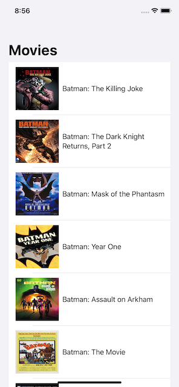
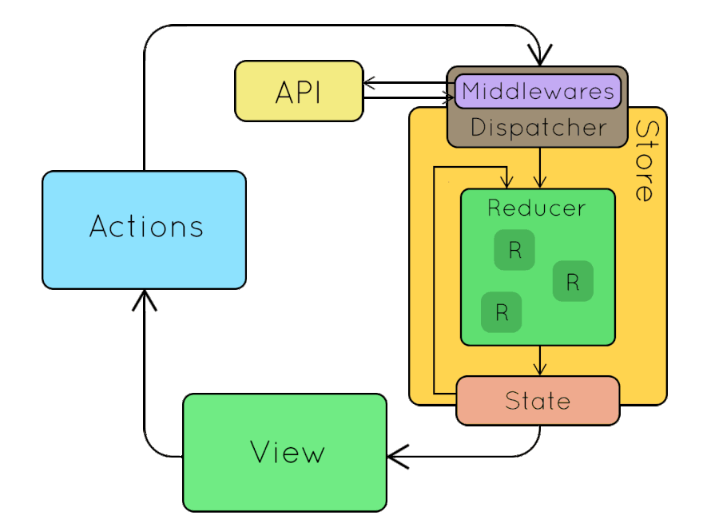

# Asynchronous Requests Using SwiftUI and Redux Middlewares 

In the [last post](redux-swiftui), we discussed how to implement Redux design pattern in SwiftUI application. One of the most common operations in an iOS app is to perform asynchronous requests and display the result on the user interface. 

In Redux architecture, middleware are used to fetch data from an API and later dispatch an action updating the store. In this post, you will learn how to implement the middleware flow in Redux. 

--- 

### What we will be building? 

We will be building a movies display application. By default, the app will display a list of batman movies, but you can customize is to integrate searching capabilities. 

We will be using the OMDB API to fetch all the movies. Make sure you are registered with the OMDB website, since you will need an API KEY to perform any request. 

> You will receive the API key in your email. Keep in mind that sometimes it can take up to 15-20 minutes to receive the email. 

Below you can find the screenshots of the MoviesApp. 



### Creating the Store

We will start by building our store. The store requires a reducer and state. For this app, we will be implementing multiple reducers and multiple states. 

> Although we will be using multiple reducer, which will manage separate slices of states. Keep in mind that in the end all reducers are combined together into one reducer. 

The Store class is implemented below: 

``` swift
class Store<StoreState: ReduxState>: ObservableObject {
    
    var reducer: Reducer<StoreState>
    @Published var state: StoreState
    var middlewares: [Middleware<StoreState>]
    
    init(reducer: @escaping Reducer<StoreState>, state: StoreState
         , middlewares: [Middleware<StoreState>] = []
    ) {
        self.reducer = reducer
        self.state = state
        self.middlewares = middlewares
    }
    
    func dispatch(action: Action) {
        DispatchQueue.main.async {
            self.state = self.reducer(self.state, action)
        }
        
        // run all the middlewares
        middlewares.forEach { middleware in
            middleware(state, action, dispatch)
        }
    }
    
}
```
The store takes in three parameters. 

**reducer:** This is the root reducer. This reducer may contain other reducers used in the app. 

**state:** This is the default global state. This state may contain other slices of the state. 

**middlewares:** A list of middlewares that are executed before the action reaches the reducer.  

Reducer and Middleware are typealias defined as follows: 

``` swift
typealias Reducer<State: ReduxState> = (_ state: State, _ action: Action) -> State
```

``` swift 
typealias Middleware<StoreState: ReduxState> = (StoreState, Action, @escaping Dispatcher) -> Void

```

Now, let's move to the middlewares. 

### Middleware 

Middleware is a piece of code, which gets executed after the action has been dispatched but before it has reached the reducer. This is a great place to call third party APIs, get the data and then dispatch an action to the reducer.



> You might be wondering, why can't we call the API inside the Actions. The main reason you cannot do that is because inside the actions you don't have access to the dispatch.  

The moviesMiddleware is implemented below: 

``` swift
func moviesMiddleware() -> Middleware<AppState> {
    
    return { state, action, dispatch in
        
        switch action {
            case _ as GetMoviesAction:
                Webservice().getAllMovies(url: Constants.Url.moviesURL) { result in
                    
                    switch result {
                        case .success(let movies):
                            print(movies)
                            dispatch(SetMoviesAction(movies: movies))
                        case .failure(let error):
                            print(error.localizedDescription)
                    }
                }
            default:
                break
        }
    }
}
```

The middleware checks for the action, which in this case is GetMoviesAction. When the correct action is found then it performs fetch movies using the Webservice. When the Webservice returns the movies, middleware dispatches another action to update the global store. 

> If you have used React with Redux then you may have performed asynchronous request inside an action creator. By default dispatch is not available inside an action creator. This is possible using thunk middleware, which is injected at the time of the creation of the store. 

The **GetMoviesAction** and **SetMoviesAction** is defined below: 

``` swift
struct GetMoviesAction: Action { }

struct SetMoviesAction: Action {
    let movies: [Movie]
}
```

In the next section, you will learn how to dispatch actions and execute middlewares. 

### Dispatching Actions and Updating State

Dispatching an action is performed inside the store. A store dispatches an action, which reaches the reducer. The reducer finally updates the global state. 

Apart from dispatching a basic action, now we need to also take middlewares into account. Right after dispatching an action we can execute all our middlewares. 

``` swift
   func dispatch(action: Action) {
        DispatchQueue.main.async {
            self.state = self.reducer(self.state, action)
        }
        
        // run all the middlewares
        middlewares.forEach { middleware in
            middleware(state, action, dispatch)
        }
    }
```

This is going to go through all the middlewares registered with the store and execute the middleware function. Middleware will be executed in the order they were inserted. 

### Displaying the Movies

Before we jump into implementing the view, we must register our store and list of middleware. This must be done at the start of our application. 

``` swift
import SwiftUI

@main
struct HelloReduxApp: App {
    var body: some Scene {
       
        let store = Store(reducer: appReducer, state: AppState(),
                          middlewares: [moviesMiddleware()])
        
        WindowGroup {
            ContentView().environmentObject(store)
        }
    }
}
```

As you can see we created a Store object and passed the root reducer, application state and a list of middlewares. The store is injected into the ContentView using the environmentObject, making it available to all the children of ContentView. 

The implementation of ContentView is shown below: 


``` swift
struct ContentView: View {
    
    @EnvironmentObject var store: Store<AppState>
    
    struct Props {
        let movies: [Movie]
        let onMoviesFetch: () -> Void
    }
    
    func map(state: AppState, dispatch: @escaping Dispatcher) -> Props {
        Props(movies: state.moviesState.movies, onMoviesFetch: {
            dispatch(GetMoviesAction())
        })
    }
    .... other code 
}
```

In ContentView, we automatically get an instance of the store using the @EnvironmentObject property wrapper. 

We also created an internal structure called Props, whose responsibility is to provide global state data to view and also to dispatch actions to update the global state. 

> This is very similar to mapStateToProps and mapDispatchToProps properties used in React and Redux. 

Finally, in the body we call the map function and populate the view. 

``` swift 
    var body: some View {
        
        let props = map(state: store.state, dispatch: store.dispatch)
        
        VStack {
            List(props.movies, id: \.imdbId) { movie in
                HStack {
                    URLImage(url: movie.poster)
                        .frame(width: 100, height: 100)
                    Text(movie.title)
                }
            }
            
            .onAppear(perform: {
                props.onMoviesFetch()
            })
            
        }.navigationTitle("Movies").embedInNavigationView()
        
        
    }
```

The result is shown below: 


### Source Code

You can download the complete project from GitHub using the link below: 

[ReduxAsync](https://github.com/azamsharp/ReduxAsync)

### References

- [SwiftUIFlux](https://github.com/Dimillian/SwiftUIFlux)
- [How to handle async requests in Redux](https://medium.com/swlh/how-to-handle-asynchronous-operations-with-redux-in-swift-495591d9df84)

### Conclusion

In this post, you learned how to use middleware to perform asynchronous request and then update the global store with data. 

<center>
<a href = "http://www.azamsharp.com/courses">
 
</a>
</center>