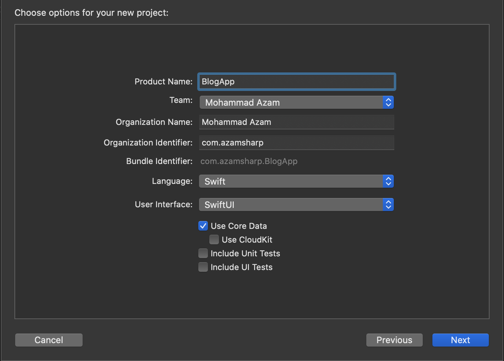
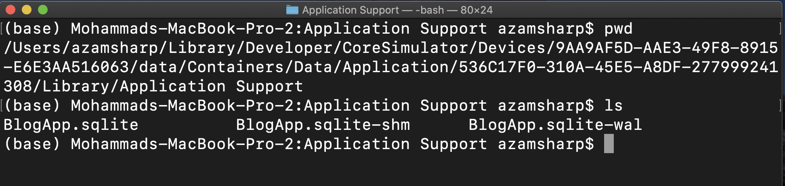
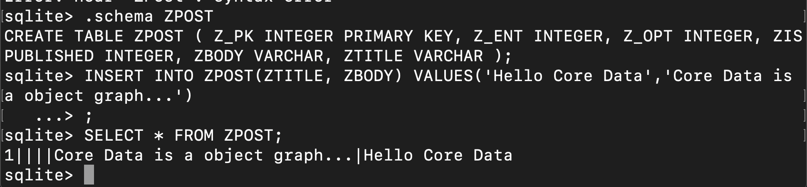

[Home](https://azamsharp.github.io)
[Courses](/courses)
[Books](/books)
[Articles](/articles)
[YouTube](https://www.youtube.com/channel/UCKvDySsrOVgUgRLhWHeyHJA?view_as=subscriber)
[Speaking](/speaking)
[Contact](/contact)

# Core Data with SwiftUI Part 1

In this post, you will learn how to integrate Core Data with your SwiftUI application using MVVM Design Pattern. You will also learn how to decouple your views with models by creating an abstraction for Core Data.     

---

### Getting Started 

Create a brand new **Single View Application** and make sure to select **SwiftUI** as the **User Interface** and check the **Use Core Data** checkbox. This will add basic Core Data setup for your application.  



If you open the **AppDelegate.swift** file you will see the setup for Core Data as shown below:  

``` swift
 let container = NSPersistentContainer(name: "BlogApp")
        container.loadPersistentStores(completionHandler: { (storeDescription, error) in
            
            print(storeDescription.url)
            
            if let error = error as NSError? {
               
                fatalError("Unresolved error \(error), \(error.userInfo)")
            }
        })

 func saveContext () {
        let context = persistentContainer.viewContext
        if context.hasChanges {
            do {
                try context.save()
            } catch {
                // Replace this implementation with code to handle the error appropriately.
                // fatalError() causes the application to generate a crash log and terminate. You should not use this function in a shipping application, although it may be useful during development.
                let nserror = error as NSError
                fatalError("Unresolved error \(nserror), \(nserror.userInfo)")
            }
        }
    }
        
```

Apart from creating the persistentContainer, Xcode will also create an empty data model file. The data model contains all the entities Core Data will use to persist information. The name of the file will be based on the Xcode project. This means for our app, the data model file will be called **BlogApp.xdatamodeld**. In the next section we will add entities to our Core Data model. 

> Core Data stores the object graph in SQLite database by default, but it can be changed to use any other persistent medium. 

### Adding Entities 

Entities define the data persisted to the database. Entities can be standalone or it can have relationship with other entities. For now, we are going to look at a single standalone entity. 

Click on the **Add Entity** button to add an entity to the data model. Change the name of entity to **Post**. In the right pane you can add attributes/properties to an entity. 


> You can also configure attributes to make sure they  are not optional or have a default value. In this app title, body and isPublished attributes are non-optional. Also, isPublished has a default value of true.  

Apart from adding attributes to an entity you also need to make sure that your class **Codegen** option is set to **Class Definition**. This means that Xcode will automatically create a class associated with your Core Data entity. 

> When you are using the code generation option then make sure that you do not modify the main implementation file for the entity class. The reason is that it will be overridden on the next code generation execution. If you want to add additional behavior to the entity class then consider writing an extension.   

In the next section we will start implementing our CoreDataManager, which will allow us to interact with our database through managed object context. 

### Core Data Manager

The main purpose of **Core Data Manager** is to provide a layer of abstraction between the **View Model** and the **View**.

> SwiftUI consists of a @FetchRequest property wrapper, which can be used directly from the view to access the database through Core Data. Unfortunately, this creates a very tight coupling between the model and the view and prevents reusability. 

We will start by creating a single instance of CoreDataManager using the Singleton design pattern. CoreDataManager will have a dependency on NSManagedObjectContext, which will be injected into the initializer.  

```swift
class CoreDataManager {
    
    static let shared = CoreDataManager(moc: NSManagedObjectContext.current)
    
    var moc: NSManagedObjectContext
    
    private init(moc: NSManagedObjectContext) {
        self.moc = moc
    }
}
```

The NSManagedObjectContext.current is a custom extension, which is responsible for returning an instance of NSManagedObjectContext.   

``` swift
extension NSManagedObjectContext {
    
    static var current: NSManagedObjectContext {
        let appDelegate = UIApplication.shared.delegate as! AppDelegate
        return appDelegate.persistentContainer.viewContext
    }
    
}
```

Next, we will create the getAllPosts function in CoreDataManager which will allow us to retrieve all the posts from the database. 

``` swift
 func getAllPosts() -> [Post] {
        
        var posts = [Post]()
        let postRequest: NSFetchRequest<Post> = Post.fetchRequest()
        
        do {
            posts = try self.moc.fetch(postRequest)
        } catch let error as NSError {
            print(error)
        }
        
        return posts
    }
```

Inside the **getAllPosts** function, we create an instance of **NSFetchRequest** and then perform the request on an instance of managed object context. In the end we get an array of posts, which we later returned from the getAllPosts function. 

> At this time, no posts will be returned because database is currently empty. We will manually add some posts from the terminal using SQL commands. 

Next, we need to create our View Models which will use the CoreDataManager to get the posts and then return it to the view. 

### Implementing ViewModels

There are several different ways of implementing ViewModels for your application. We usually recommend one ViewModel per screen, which may or may not contain other child view models. 

We will be implementing two view models. The parent view model **PostListViewModel** will represent the entire screen, responsible for displaying all the posts. PostListViewModel will also be responsible for fetching all the posts using the CoreDataManager. 

``` swift
class PostListViewModel: ObservableObject {
    
    @Published
    var posts = [PostViewModel]()
    
    init() {
        fetchAllPosts()
    }
    
    func fetchAllPosts() {
        DispatchQueue.main.async {
             self.posts = CoreDataManager.shared.getAllPosts().map(PostViewModel.init)
        }
    }
    
}
```

> You can also add constructor dependency injection to your PostListViewModel. This will help during testing and mocking the PostListViewModel. 

The child view model **PostViewModel** will represent each post. PostViewModel does not contain any behavior but just represents the data to be displayed on the screen. 

``` swift
class PostViewModel {
    
    var post: Post
    
    init(post: Post) {
        self.post = post
    }
    
    var title: String {
        self.post.title ?? ""
    }
    
    var body: String {
        self.post.body ?? ""
    }
    
    var published: Bool {
        self.post.isPublished
    } 
}
```

> PostViewModel will only expose the properties needed by the view. This means that the model can have dozen properties but view model only uses a handful, because it is required by the view. 

### Inserting Data Using SQL

In order to use SQL to add few dummy posts, we must first find out the path of the SQLite database file. Open AppDelegate.swift and print the storeDescription.url property. 

``` swift
let container = NSPersistentContainer(name: "BlogApp")
        container.loadPersistentStores(completionHandler: { (storeDescription, error) in
            
            print(storeDescription.url) 
```

The storeDescription.url property is going to print the location of the physical SQLite file. 


If you go to that location, you will find the BlogApp.sqlite file as shown below in the screenshot. 



Once, you reach the correct location of the SQLite file, you can run ```sqlite3 BlogApp.sqlite``` to start the SQLite CLI. 

Now run ```.tables``` to view all the tables in the BlogApp database. 

```
sqlite> .tables
ZPOST Z_METADATA    Z_MODELCACHE  Z_PRIMARYKEY
```

The table called ZPOST is our table. Let's see what is inside that table. 

```
sqlite> select * from zpost;
sqlite> 
```
As expected, the table is completely empty. Let's add few dummy records in the database using the SQL INSERT command. 



You can also copy/paste the steps from the code below: 


``` sql
sqlite> .schema ZPOST
CREATE TABLE ZPOST ( Z_PK INTEGER PRIMARY KEY, Z_ENT INTEGER, Z_OPT INTEGER, ZISPUBLISHED INTEGER, ZBODY VARCHAR, ZTITLE VARCHAR );
sqlite> INSERT INTO ZPOST(ZTITLE, ZBODY) VALUES('Hello Core Data','Core Data is
a object graph...')
   ...> ;
sqlite> SELECT * FROM ZPOST;
1||||Core Data is a object graph...|Hello Core Data
```

Now, that we have data in the database. Next step is to display the data in the SwiftUI view. 

### Displaying Posts 

The view will use the view model to fetch all the posts from the SQLite database and then display them on the screen. Our view implementation is very simple as shown below: 

``` swift
struct ContentView: View {
    
    @ObservedObject private var postListVM = PostListViewModel()
    
    var body: some View {
        
        List(postListVM.posts, id: \.title) { post in
            Text(post.title)
        }
        
            .onAppear() {
                self.postListVM.fetchAllPosts()
        }
        
    }
}
```

> We have used title as the id for the List. In an actual application your model should have a unique identifier. 

You can download the source code from the [GitHub repository](https://github.com/azamsharp/BlogApp). 

### Conclusion 

In this post, we learned how to setup Core Data for a  SwiftUI app using MVVM Design Pattern. In the next post, we will cover the remaining CRUD operations, including create, update and delete. 

<center>
<a href = "http://www.azamsharp.com/courses">
 
</a>
</center>


