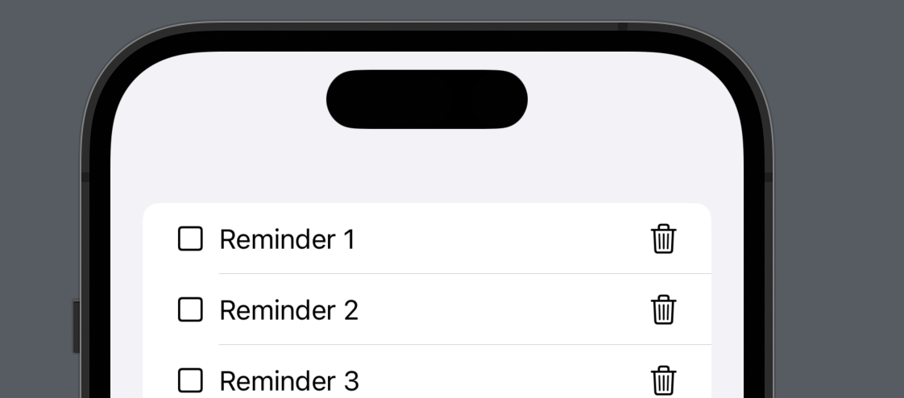

# A Better Way to Handle Events from SwiftUI Views 

One way to make reusable views in SwiftUI is to expose the events as a closure. This allows the parent to consume the closure and take action. In this post, I will demonstrate how the events from a SwiftUI view can be grouped together into an enum allowing you to reduce code for creating multiple closures per view. 

## Multiple Closures 

Consider a situation where we are displaying a list of reminders. Each reminder is represented by a ReminderCellView view. The implementation is shown below: 

``` swift
 List(1...20, id: \.self) { index in
            ReminderCellView(index: index)
    }
```



As you can see, each ReminderViewCell consists of a checkbox and a delete button (trash icon). The checkbox and the delete button will trigger an event, which can be handled by the parent view through the use of closures. This is shown in the implementation below: 

``` swift 
struct ReminderCellView: View {
    
    let index: Int
    let onChecked: (Int) -> Void
    let onDelete: (Int) -> Void

    var body: some View {
        HStack {
            Image(systemName: "square")
                .onTapGesture {
                    onChecked(index)
                }
            Text("ReminderCellView \(index)")
            Spacer()
            Image(systemName: "trash")
                .onTapGesture {
                    onDelete(index)
                }
        }
    }
}
```

ReminderCellView consists of multiple closures, which includes onChecked and onDelete. The parent view is responsible for providing the implementation for onChecked and onDelete events. This is shown in the implementation below: 

``` swift 
struct ContentView: View {

    var body: some View {
        List(1...20, id: \.self) { index in
            ReminderCellView(index: index, onChecked: { index in
                // do something
            }, onDelete: { index in
                // do something
            })
        }
    }
}
```

Although this works as expected but we can definitely improve it by using enums instead of multiple closures. 

## Grouping Events Using an Enum 

In the last section we had to expose onChecked and onDelete events from ReminderCellView. Instead of exposing multiple closures, we can group them into a single enum. This is shown in the implementation below: 

``` swift 
enum ReminderCellEvents {
    case onChecked(Int)
    case onDelete(Int)
}

struct ReminderCellView: View {
    
    let index: Int
    let onEvent: (ReminderCellEvents) -> Void
    
    var body: some View {
        HStack {
            Image(systemName: "square")
                .onTapGesture {
                    onEvent(.onChecked(index))
                }
            Text("ReminderCellView \(index)")
            Spacer()
            Image(systemName: "trash")
                .onTapGesture {
                    onEvent(.onDelete(index))
                }
        }
    }
}
```

The above code is much cleaner and easier to understand as compared to before. The calling also looks much better as shown below: 

``` swift 
struct ContentView: View {

    var body: some View {
        List(1...20, id: \.self) { index in
            ReminderCellView(index: index) { event in
                switch event {
                    case .onChecked(let index):
                        print(index)
                    case .onDelete(let index):
                        print(index)
                }
            }
        }
    }
}
```
 
Nice and clean! 

I hope you enjoyed this article. Happy coding! 