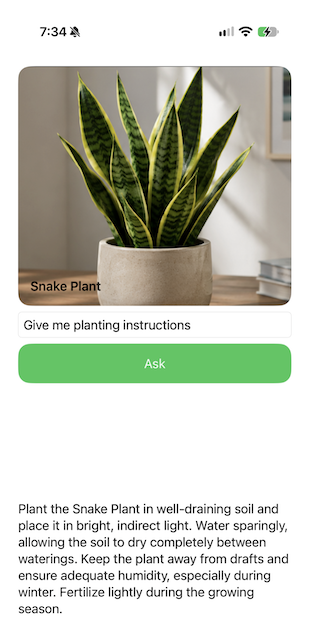

# Working with Images Using Foundation Models

> This article is part of my upcoming book on Apple’s Foundation Models framework, where I explore practical ways to build intelligent features for iOS applications.

Foundation Models are not limited to working with text. Starting with iOS 27, the Foundation Models framework can also work with images, allowing visual content to become part of our prompts and conversations.

This opens up many interesting possibilities. Instead of describing an object to the model, we can provide an image and ask questions about what it sees. We can identify a plant, describe objects in a photo, generate structured information, and continue asking follow-up questions about the image.

This is different from traditional image recognition, where models such as ResNet50 or MobileNet are typically used to classify images into predefined categories. With Foundation Models, the image becomes part of a natural language interaction. What the model does with the image depends on the question we ask.

In this article, we will explore how to attach images to prompts and generate structured responses from visual content. We will build a Plant Assistant that identifies plants from images and allows the user to continue the conversation by asking questions about plant care, sunlight, watering, and more.

By the end, you will understand how images, prompts, structured generation, and conversational sessions can work together to build applications that understand and interact with visual content.

<!-- Book Banner: SwiftUI Architecture Book -->
<div class="azam-book-banner" role="region" aria-label="SwiftUI Architecture Book Banner">
  <div class="azam-book-banner__inner">
    <div class="azam-book-banner__cover">
      
    </div>
    <div class="azam-book-banner__content">
      <p class="azam-book-banner__eyebrow">SwiftUI Architecture Book</p>
      <h3 class="azam-book-banner__title">Patterns and Practices for Building Scalable Applications</h3>
      <p class="azam-book-banner__subtitle">
        A practical guide to building SwiftUI apps that stay clean as they grow.
      </p>
      <div class="azam-book-banner__actions">
        <a class="azam-book-banner__button" href="https://azamsharp.school/swiftui-architecture-book.html" target="_blank" rel="noopener">
          Get the book
        </a>
      </div>
    </div>
  </div>
</div>

<style>
  .azam-book-banner {
    --bg1: #0b1220;
    --bg2: #111a2d;
    --text: rgba(255, 255, 255, 0.92);
    --muted: rgba(255, 255, 255, 0.74);
    --border: rgba(255, 255, 255, 0.12);
    --shadow: 0 18px 45px rgba(0, 0, 0, 0.28);
    --accent: #6ee7b7; /* tweak to match your brand */
    --accent2: #60a5fa;

    margin: 22px 0;
    color: var(--text);
    border: 1px solid var(--border);
    border-radius: 16px;
    overflow: hidden;
    background: radial-gradient(1200px 600px at 10% 0%, rgba(96, 165, 250, 0.22), transparent 60%),
                radial-gradient(900px 500px at 90% 30%, rgba(110, 231, 183, 0.18), transparent 60%),
                linear-gradient(135deg, var(--bg1), var(--bg2));
    box-shadow: var(--shadow);
  }

  .azam-book-banner__inner {
    display: grid;
    grid-template-columns: 132px 1fr;
    gap: 18px;
    padding: 18px;
    align-items: center;
  }

  .azam-book-banner__cover {
    display: flex;
    justify-content: center;
    align-items: center;
  }

  .azam-book-banner__cover img {
    width: 132px;
    height: auto;
    border-radius: 12px;
    border: 1px solid rgba(255,255,255,0.14);
    box-shadow: 0 14px 28px rgba(0,0,0,0.35);
    background: rgba(255,255,255,0.04);
  }

  .azam-book-banner__eyebrow {
    margin: 0 0 6px 0;
    font-size: 12px;
    letter-spacing: 0.08em;
    text-transform: uppercase;
    color: var(--muted);
  }

  .azam-book-banner__title {
    margin: 0 0 8px 0;
    font-size: 18px;
    line-height: 1.25;
  }

  .azam-book-banner__subtitle {
    margin: 0 0 14px 0;
    font-size: 14px;
    line-height: 1.55;
    color: var(--muted);
    max-width: 62ch;
  }

  .azam-book-banner__actions {
    display: flex;
    gap: 12px;
    align-items: center;
    flex-wrap: wrap;
  }

  .azam-book-banner__button {
    display: inline-flex;
    align-items: center;
    justify-content: center;
    padding: 10px 14px;
    border-radius: 12px;
    font-weight: 700;
    font-size: 14px;
    color: #071018;
    text-decoration: none;
    background: linear-gradient(135deg, var(--accent), var(--accent2));
    border: 0;
    box-shadow: 0 10px 22px rgba(0,0,0,0.28);
    transition: transform 140ms ease, filter 140ms ease;
  }

  .azam-book-banner__button:hover {
    transform: translateY(-1px);
    filter: brightness(1.02);
  }

  .azam-book-banner__link {
    font-size: 14px;
    color: rgba(255,255,255,0.86);
    text-decoration: none;
    border-bottom: 1px solid rgba(255,255,255,0.22);
    padding-bottom: 2px;
    transition: border-color 140ms ease, color 140ms ease;
  }

  .azam-book-banner__link:hover {
    color: rgba(255,255,255,0.95);
    border-color: rgba(255,255,255,0.45);
  }

  /* Mobile */
  @media (max-width: 520px) {
    .azam-book-banner__inner {
      grid-template-columns: 1fr;
      text-align: left;
    }

    .azam-book-banner__cover {
      justify-content: flex-start;
    }

    .azam-book-banner__cover img {
      width: 120px;
    }
  }
</style>

### Image Recognition vs Image Understanding 

Before working with Foundation Models, you may have used image recognition models such as ResNet50 or MobileNet. These models are commonly used to classify images into a predefined set of categories. We provide an image to the model and it may tell us that the image contains a cat, dog, car, or some other category it was trained to recognize.
Foundation Models allow us to interact with images in a different way. Instead of only asking the model to classify an image, we can attach an image to a prompt and ask questions about what the model sees.
For example, an image recognition model may look at an image and return:
cat

With Foundation Models, we can ask:

What animal is shown in this image?

But we don't have to stop there. We can ask:

What is the cat doing?

Where is the cat sitting?

What objects are around the cat?

Describe this image in one sentence.

This is the difference between image recognition and image understanding. Image recognition is usually about identifying or classifying something in an image. Image understanding allows us to have a much richer interaction with the visual content. The question we ask becomes part of how the image is interpreted.

This does not mean that Foundation Models replace models such as ResNet50 or MobileNet. If our application needs to classify images into a known set of categories, a dedicated image recognition model may still be a better and more predictable solution. Foundation Models are particularly useful when we don't know all the questions users may ask ahead of time and want them to interact with images using natural language.

### Understanding Images with Foundation Models

I love gardening and being around plants. I have several plants in my home office, and I really enjoy taking care of them. During breakfast, I also like looking outside the window and watching hummingbirds visit the garden. It is something I look forward to every morning.
So when I was thinking about an example for image understanding, plants felt like a natural choice. In this section, we will build a simple Plant Assistant that displays several plant images in a horizontal ScrollView. As the user swipes from one plant to another, we will send the active image to the model and ask it to identify the plant. Once the plant has been identified, the user can continue the conversation by asking questions such as how often the plant should be watered, whether it needs direct sunlight, or whether it is easy to take care of.

For this example, the plant images are included with the application. This allows us to focus on Foundation Models instead of spending time setting up the photo library or camera. In a real application, we could allow the user to select an image from the photo library or take a picture using the camera. Once we have the image as a UIImage, the Foundation Models portion of the application works in much the same way.

Take a look at the Plant Identifier application screenshot below: 



### Creating the Generated Types

Let's start by creating the types that represent the responses we expect from the model. When a plant image becomes active, we want the model to identify the plant and provide a short description.
``` swift 
@Generable
struct Plant {
    let name: String
    let description: String
}
```

Since Plant is marked with @Generable, we can ask the model to generate a response directly using this structure. This is much more useful than receiving a large string and then trying to extract the plant name and description ourselves.

We also need a type for answers to follow-up questions.

``` swift 
@Generable
struct PlantAnswer {
    let answer: String
}
```

The two types represent different parts of our interaction. Plant represents what the model learns when it analyzes a new plant image, while PlantAnswer represents an answer to a question after the plant has already been identified. We will use this same separation when we implement the identify and ask functions.

### Creating the PlantIdentifier

The PlantIdentifier is responsible for communicating with the LanguageModelSession. It stores the identified plant as well as any answer currently being generated.

``` swift 
@Observable
class PlantIdentifier {
    
    let session: LanguageModelSession
    var plant: Plant?
    var plantAnswer: PlantAnswer.PartiallyGenerated?
    
    init(session: LanguageModelSession) {
        self.session = session
    }
    
    var isResponding: Bool {
        session.isResponding
    }
    
    func ask(_ prompt: String) async throws {
        
        let stream = session.streamResponse(to: prompt, generating: PlantAnswer.self)
        
        for try await partial in stream {
            plantAnswer = partial.content
        }
    }
    
    func identify(_ imageName: String) async throws {
        
        guard let uiImage = UIImage(named: imageName) else { return }
        let attachment = Attachment(uiImage)
        
        let response = try await session.respond(generating: Plant.self) {
            "What plant is this?"
            attachment
        }
        
        plant = response.content
    }

}
```

Notice that plant is stored as a regular Plant, while plantAnswer is stored as PlantAnswer.PartiallyGenerated. This is intentional. Identifying a plant produces a small structured response containing the plant name and description, so there is not much benefit in streaming that result. We can simply wait for respond to complete and assign the generated Plant.
Answers to user questions may be longer. For those responses, streaming makes more sense because we can start displaying the answer while the model is still generating it.

### Identifying a Plant

Now that we have our PlantIdentifier, we can use it to identify the active plant. Since our images are stored in the asset catalog, the identify function only needs the name of the image.

``` swift 
func identify(_ imageName: String) async throws {
    guard let uiImage = UIImage(named: imageName) else {
        return
    }

    let attachment = Attachment(uiImage)

    let response = try await session.respond(
        generating: Plant.self
    ) {
        "What plant is this?"
        attachment
    }

    plant = response.content
}
```

We start by loading the image from the asset catalog.

``` swift 
guard let uiImage = UIImage(named: imageName) else {
    return
}
```

Once we have the UIImage, we create an Attachment.

``` swift 
let attachment = Attachment(uiImage)
```

The attachment is what allows us to include the image when communicating with the LanguageModelSession. We can then send our prompt along with the image and ask the model to generate a Plant.

``` swift 
let response = try await session.respond(
    generating: Plant.self
) {
    "What plant is this?"
    attachment
}
```

The prompt tells the model what we want to know, while the attachment provides the visual information needed to answer the question. We also specify Plant.self, which means the response will be generated using our Plant type instead of coming back as an unstructured string.
Finally, we assign the generated plant to the plant property.

``` swift 
plant = response.content
```

Since PlantIdentifier is observable, any SwiftUI views using the plant property will automatically update when the identification is complete.

One nice thing about this approach is that the view does not need to worry about creating a UIImage or an Attachment. It simply passes the name of the active image to PlantIdentifier, and PlantIdentifier takes care of the rest.

### Asking Questions About the Plant

At this point, our application can identify a plant from an image, but we don't want to stop there. Once the plant has been identified, the user should be able to ask questions about it.
For example, after identifying a Monstera, the user may ask:

How often should I water it?
Does it need direct sunlight?
Is it safe for pets?
We can handle these questions using the ask function.

``` swift 
func ask(_ prompt: String) async throws {
    let stream = session.streamResponse(
        to: prompt,
        generating: PlantAnswer.self
    )

    for try await partial in stream {
        plantAnswer = partial.content
    }
}
```

There is an important difference between identify and ask. When we identify a plant, we provide both the prompt and the image. When we ask a follow-up question, we only provide the question.
``` swift 
let stream = session.streamResponse(
    to: prompt,
    generating: PlantAnswer.self
)
```

We can do this because we are using the same LanguageModelSession. The plant image and the identification request are already part of the conversation, so the user can continue asking questions about the plant without attaching the same image again.

For follow-up questions, we are also using streamResponse instead of respond. Identifying a plant gives us a small response containing the name and description, so there is not much benefit in streaming it. An answer to a question can be longer, so streaming allows us to start displaying the response as it is generated.

In the next section, we are going to configure our PlantIdentifier and make sure it is instantiated with all the required dependencies. 

### Configuring the Language Model Session
Now that we have our PlantIdentifier, we can create the ContentView. We will start with four plant images that have already been added to the asset catalog.

``` swift 
struct ContentView: View {

    let plants = // array of plant images 

    @State private var activePlant: String?
    @State private var prompt = ""
    @State private var plantIdentifier: PlantIdentifier

    init() {

        let session = LanguageModelSession {
            """
            You are a plant identification expert.
            Analyze the provided plant image and identify the plant.
            Provide the common name and a short description of the plant.
            """
        }

        _plantIdentifier = State(
            initialValue: PlantIdentifier(
                session: session
            )
        )
    }

    // ...
}
```

The plants array contains the names of our images, while activePlant keeps track of the plant currently selected by the user. We also create a single LanguageModelSession and use it to initialize PlantIdentifier. Keeping the same session is important because we want the user to be able to identify a plant and then continue asking questions about it.

In a larger application, we could create PlantIdentifier higher up in the view hierarchy and inject it into the SwiftUI environment. This would make sense if several screens needed access to the same PlantIdentifier. In our application, all of the plant functionality lives on a single screen, so creating and storing it directly in ContentView keeps things simple.

At this point, our application is doing more than identifying plants. When the user swipes to a new plant, we send the image to the LanguageModelSession so the model can understand what it is looking at. Once that work is complete, the image becomes the starting point for a conversation. The user can continue asking questions without requiring the application to send and process the same image for every request.

In this example, our plant images are bundled with the application, but the same idea can be used with images from the photo library or camera. Once we have a UIImage, we can turn it into an Attachment and provide it to the model.

### Conclusion 

Working with images opens up a new set of possibilities for applications built with the Foundation Models framework. Instead of limiting our interactions to text, we can now provide visual content and ask the model to understand and reason about what it sees.

In this chapter, we built a Plant Assistant that identifies plants from images and generates structured information using @Generable types. More importantly, we saw that the image can become part of an ongoing conversation. Once the image has been provided to the LanguageModelSession, the user can continue asking questions without sending the same image with every request.

We also discussed the difference between traditional image recognition and image understanding. Models such as ResNet50 and MobileNet are useful when we need predictable classification into known categories. Foundation Models are useful when we want users to interact with visual content more naturally and ask questions that we may not have anticipated when building the application.

The key idea is that images are no longer just something our applications display. They can become part of the context we provide to the model. By combining images, prompts, structured generation, and conversational sessions, we can build applications that understand both what the user says and what the user sees.

### Continue Learning with AzamSharp School

Become an AzamSharp School member and get access to more than 250 hours of practical courses covering SwiftUI, SwiftData, testing, architecture, AI, machine learning, and more.

Your membership also includes access to AzamSharp books, live workshops, office hours, and new content added regularly.

[Join AzamSharp School](https://azamsharp.school)