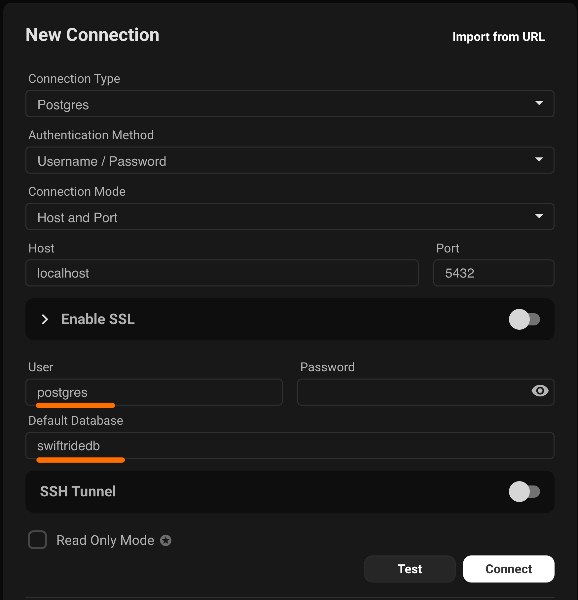

# SwiftRide – Building a Ride Sharing App (Part 2 – Creating the Models)

In the [last part](/_posts/2026-03-11-swiftride-setting-up-the-stack.md) we setup the stack for our application. This included creating the database (without tables) and installing most of the required node packages that we will be using in our application. In this part, we will move things one step further and create our tables and the associated models. 

### Sequelize Migrations  

You may be very tempted to open your newly created database with a visual tool like Base or BeeKeeper etc and add tables, manually. Please don't. Since we are using Sequelize ORM, we need to use Sequelize migrations to configure the schema of the database. If you start changing the tables using a visual designer then Sequelize will loose all tracking and it will not know what is going on.  

There are various ways of creating your migration file. You can create a new migration empty template using the Sequelize terminal command. 

``` javascript 
npx sequelize-cli migration:generate --name create-user
```

This will only create the migration file. But in this particular case, I also want to create the associated `User` model. So, we will use a different Sequelize command. 

``` javascript 
npx sequelize-cli model:generate --name User --attributes username:string,password:string,role:string
```

This will not only create the `User` model with `username`, `password` and `role` attributes but also a migration file to create the table associated with the `User` model. 

> In Sequelize tables are named after the name of the model but they are pluralized. This means if your model name is User then in the database Sequelize will create a table called Users. 

The migration file is shown below: 

``` swift 
'use strict';
/** @type {import('sequelize-cli').Migration} */
module.exports = {
  async up(queryInterface, Sequelize) {
    await queryInterface.createTable('Users', {
      id: {
        allowNull: false,
        autoIncrement: true,
        primaryKey: true,
        type: Sequelize.INTEGER
      },
      username: {
        type: Sequelize.STRING
      },
      password: {
        type: Sequelize.STRING
      },
      role: {
        type: Sequelize.STRING
      },
      createdAt: {
        allowNull: false,
        type: Sequelize.DATE
      },
      updatedAt: {
        allowNull: false,
        type: Sequelize.DATE
      }
    });
  },
  async down(queryInterface, Sequelize) {
    await queryInterface.dropTable('Users');
  }
};
```

Keep in mind that this migration file, along with all the code in the file is created automatically by running the following command from the terminal. 

``` javascript 
npx sequelize-cli model:generate --name User --attributes username:string,password:string,role:string
```

If you run this migration then it will create the `Users` table in the `swiftridedb` database. You can use any Postgres visual tool to look at the database. I recommend [BeeKeeper](https://www.beekeeperstudio.io/get). BeeKeeper is free for MacOS, Linux and Windows.  



Each migration has two different methods. The up method is executed when you run the migration and the down method is executed when you undo a migration. Whatever you do in the up method, just remember to do the opposite in the down method. 

> I have on purpose made the role attribute as a string instead of a roldId. In the next section we will add a `Roles` table and also update our `Users` table schema through migration to support roleId, instead of the role name. 

### Creating Roles Table and Adding Relationship Between Users and Roles 

Our next step is to add `Roles` table and also update the `Users` table to have a relationship with the `Roles` table through roleId. This can be done in multiple steps. First we can use the Sequelize command to create the Role model and the associated migration file. This is shown below: 

``` javascript 
npx sequelize-cli model:generate --name Role --attributes name:string
```

Next, we can write a custom migration which will remove the role column from `Users` table and add a new `roleId` column. The `roleId` column will serve as a foreign key in `Users` table and will be linked to the `id` column in the `Roles` table. 
