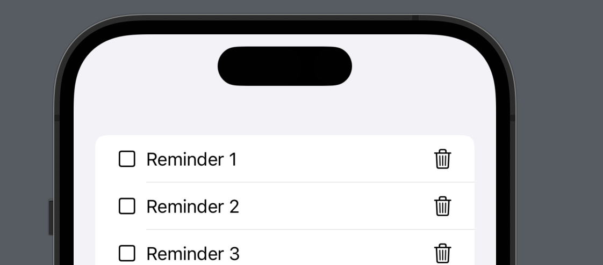

# A Better Way to Handle Events from SwiftUI Views 

One way to make reusable views in SwiftUI is to expose the events as a closure. This allows the parent to consume the closure and take action. In this post, I will demonstrate how the events from a SwiftUI view can be grouped together into an enum allowing you to reduce code for creating multiple closures per view. 

## Multiple Closures 

Consider a situation where we are displaying a list of reminders. Each reminder is represented by a ReminderCellView view. The implementation is shown below: 

``` swift
 List(1...20, id: \.self) { index in
            ReminderCellView(index: index)
    }
```



As you can see that each ReminderViewCell consists of a checkbox and a delete button (trash icon). The checkbox and the delete will causes Instead of handling the events inside the ReminderViewCell, we would like to expose those events  


## Conclusion 