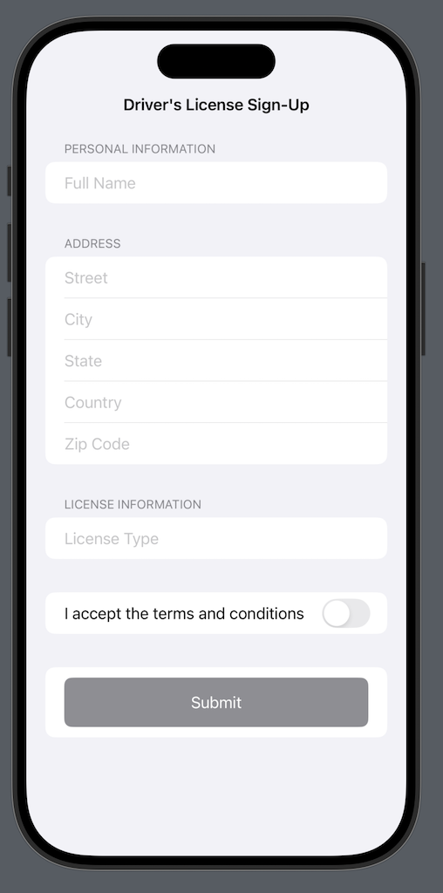
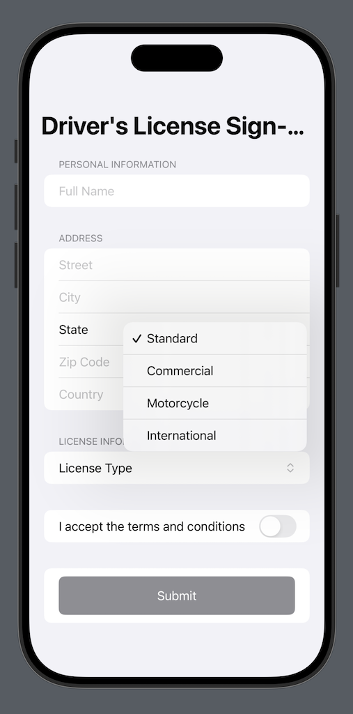
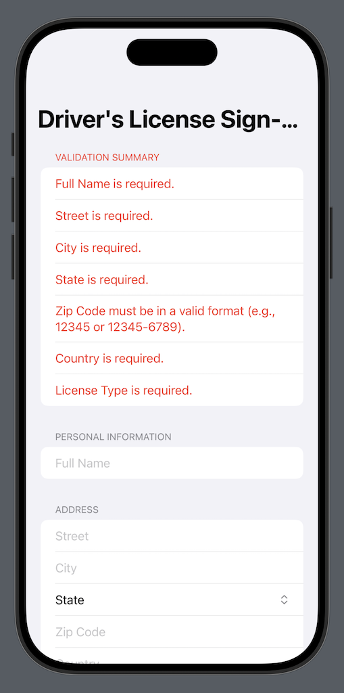

# The Ultimate Guide to Validation Patterns in SwiftUI 

Validation is a crucial component of app development, ensuring that only accurate and meaningful data is processed by your application. As the saying goes in software development, **Garbage in, garbage out.** If your app allows users to submit invalid data, it will inevitably result in unreliable and flawed outputs.

In this article, we will explore various techniques for implementing robust validation in your SwiftUI forms to enhance data integrity and user experience.

<div style="
    background-color: #f0f8ff;
    border-left: 5px solid #0073e6;
    padding: 20px;
    border-radius: 5px;
    font-family: Arial, sans-serif;
    font-size: 1.1rem;
    color: #333;
    margin: 20px 0;
">
    <strong>Want to become a highly valued iOS developer?</strong> 
    Check out AzamSharp School for comprehensive courses and hands-on learning at 
    <a href="https://azamsharp.school" style="color: #0073e6; text-decoration: none; font-weight: bold;">azamsharp.school</a>.
</div>

### Simple Validation

Validation does not have to be complicated. The main idea is to convey to the users that their input is invalid. The conveying part can be performed in many different ways, including enabling or disabling certain actions.

In the following code, we implemented a Login screen and used basic validation to check if username and password are provided by the user. If they are not  then the Login button will be disabled. 

``` swift 
struct LoginScreen: View {
    
    @State private var username: String = ""
    @State private var password: String = ""
    
    private var isFormValid: Bool {
        return !username.isEmptyOrWhitespace && !password.isEmptyOrWhitespace
    }
    
    var body: some View {
        Form {
            TextField("Username", text: $username)
            TextField("Password", text: $password)
            Button("Login") {
                
            }.disabled(!isFormValid)
        }

    }
}
```

In straightforward scenarios like this, error messages aren't even necessary because it's immediately clear to the user that they cannot proceed until they provide their credentials.

Sometimes the use of user interface components also plays an important role in keeping invalid data out. Take a look at the following screenshot. 



At first glance, the form appears to be well-designed. However, upon closer inspection, there is a significant risk that users might provide incorrect input for critical fields like **state**, **license type**, and **country**. These fields often play a crucial role in processing and validation, making accurate data essential.

> While similar concerns can be raised for fields like **street**, **city**, and **zip code**, these generally have a lower impact on the overall process in most cases. However, if these fields are critical to the app's functionality—such as for location-based services or accurate delivery—it would be beneficial to integrate the form with Google Location Services or a similar geocoding API. This ensures the data entered is validated and aligned with real-world locations, improving accuracy and reliability.

A straightforward and effective solution would be to replace the text input with a user interface component, such as a dropdown menu or picker, that allows users to select an option from predefined choices. This approach minimizes errors, ensures data consistency, and provides a more user-friendly experience. 



The **Driver License Sign-Up Form** can greatly benefit from displaying error messages to the user. Since the form consists of multiple fields, each with specific requirements (e.g., format, type, or length), clear error messages help users understand and correct mistakes. This improves the overall user experience, reduces frustration, and ensures that the submitted data meets the necessary validation criteria.

In the next section, we will explore effective strategies for displaying a validation summary to users, ensuring they can easily identify and correct errors in the form. This approach enhances usability and ensures accurate data entry.

### Validation Summary 

A validation summary is an efficient way to display all form validation errors in a single location, enabling users to quickly review the issues and take appropriate action to correct them. This approach enhances usability by providing clear, consolidated feedback rather than scattering error messages throughout the form.

The simplest way to implement a validation summary is by maintaining a single array to track all validation errors. While you can use a custom type to represent error objects for more flexibility, starting with a straightforward array of strings is often sufficient for basic implementations.

``` swift 
  @State private var validationErrors: [String] = [] // To store validation error messages
```

When the user submits the form by pressing the Submit button, we can trigger validation for the entire form. The validate function below handles this process by checking all form fields for compliance with their requirements. If any validation rules are violated, appropriate error messages are added to the validationErrors array.

``` swift 
 private func validate() -> Bool {
        validationErrors = [] // Clear previous errors

        // Validate each field
        if fullName.trimmingCharacters(in: .whitespaces).isEmpty {
            validationErrors.append("Full Name is required.")
        }
        if street.trimmingCharacters(in: .whitespaces).isEmpty {
            validationErrors.append("Street is required.")
        }
        if city.trimmingCharacters(in: .whitespaces).isEmpty {
            validationErrors.append("City is required.")
        }
        if selectedState.isEmpty {
            validationErrors.append("State is required.")
        }
        if zipCode.trimmingCharacters(in: .whitespaces).isEmpty || !zipCode.isValidZipCode {
            validationErrors.append("Zip Code must be in a valid format (e.g., 12345 or 12345-6789).")
        }
        if country.trimmingCharacters(in: .whitespaces).isEmpty {
            validationErrors.append("Country is required.")
        }
        if selectedLicenseType.isEmpty {
            validationErrors.append("License Type is required.")
        }
        if !agreementAccepted {
            validationErrors.append("You must accept the terms and conditions.")
        }

        return validationErrors.isEmpty
        
    }
```

If there are any errors then you can loop through the errors and display them. This is shown in the implementation below: 

``` swift 
 Form {
                // Validation summary section
                if !validationErrors.isEmpty {
                    Section(header: Text("Validation Summary").foregroundColor(.red)) {
                        ForEach(validationErrors, id: \.self) { error in
                            Text(error).foregroundColor(.red)
                        }
                    }
                }

```

The result is shown below: 



Now, the user can address the errors one by one. As each error is resolved, the user can reattempt submission until all issues are fixed and the form is successfully submitted. This iterative process ensures that the user has clear guidance to complete the form correctly.

It's likely that you'll need to display validation errors on other screens as well. To make your code more reusable and maintainable, you can extract this functionality into a standalone validation summary component, as shown below:

``` swift 
struct ValidationSummary: View {
    let validationErrors: [String]
    
    var body: some View {
        
        Section(header: Text("Validation Summary").foregroundColor(.red)) {
            ForEach(validationErrors, id: \.self) { error in
                Text(error)
                    .foregroundColor(.red)
            }
        }
        
    }
}

```

> Feel free to customize validation summary control to fit your needs. This is a great opportunity to communicate with your designer and come up with an intuitive presentation of the validation error messages. 

### Validation TextField Controls 

### Inline Validation Error Messages (Inspired from Flutter)

### Model Validation Using Property Wrappers (Inspiring from ASP.NET)

ASP.NET, a widely adopted web technology from Microsoft, is extensively utilized in enterprise applications. It provides developers with powerful tools to streamline client-side validation by decorating the model with attributes, as demonstrated in the example below:

``` swift 
using System.ComponentModel.DataAnnotations;

public class Product
{
    [Required(ErrorMessage = "Product name is required")]
    [StringLength(50, ErrorMessage = "Product name cannot exceed 50 characters")]
    public string Name { get; set; }

    [Range(0.01, 9999.99, ErrorMessage = "Price must be between 0.01 and 9999.99")]
    public decimal Price { get; set; }

    [Required(ErrorMessage = "Category is required")]
    public string Category { get; set; }
}
```

This allows developers to implement validation directly at the client-side model level, a technique that can be effectively applied in SwiftUI using property wrappers.

The first step is to create a view state specifically for the `LoginScreen`. Since this state is only relevant to the `LoginScreen`, it can be defined within the view itself, as demonstrated below:

``` swift 
struct LoginScreen: View {
    
    struct LoginState {

        var username: String = ""
        var password: String = ""
        var email: String = ""
        
        func validate() -> [String] {
            // validate the fields 
            return [] 
        }
    }
}
```

Currently, the properties of `LoginState` do not use any property wrappers. Next, we will implement the `Required` property wrapper, which will enforce that a value is provided for the associated property.

``` swift 
@propertyWrapper
struct Required {
    
    private var value: String
    private let message: String

    var wrappedValue: String {
        get { value }
        set { value = newValue }
    }

    var projectedValue: String? {
        return value.isEmpty ? message : nil
    }

    init(wrappedValue: String, _ message: String) {
        print(wrappedValue)
        self.value = wrappedValue
        self.message = message
    }
}
```

The `Required` property wrapper accepts two parameters: `value` and `message`. The `value` refers to the property it decorates, while the `message` specifies the error message to display when the validation fails.

Now, we can apply the `Required` property wrapper to the properties in the `LoginState` and implement a `validate` function. This function will ensure that all decorated properties in the `LoginState` are validated successfully.

``` swift 
 struct LoginState {
        @Required("Username is required")
        var username: String = "johndoe"
        @Required("Password is required")
        var password: String = ""
        
        @Required("Email is required")
        var email: String = ""
        
        func validate() -> [String] {
            var errors: [String] = []
            
            if let usernameError = $username {
                errors.append(usernameError)
            }
            
            if let passwordError = $password {
                errors.append(passwordError)
            }
            
            if let emailError = $email {
                errors.append(emailError)
            }
            
            return errors
        }
    }
```

The usage in shown below: 

``` swift 
@State private var loginState = LoginState()
@State private var errors: [String] = []
    
    var body: some View {
        Form {
            TextField("Username", text: $loginState.username)
            TextField("Password", text: $loginState.password)
            TextField("Email", text: $loginState.email)
            
            Button("Login") {
                errors = loginState.validate()
                if errors.isEmpty {
                   // perform login 
                }
            }
            
            if !errors.isEmpty {
                ForEach(errors, id: \.self) { error in
                    Text(error)
                }
            }
            
        }.navigationTitle("Login")
    }
```

The `loginState.validate` function performs validation on the form fields and returns an array of error messages for any invalid inputs. If the array contains error messages, it indicates that the form is invalid, and the errors are dynamically displayed on the screen. This ensures users receive immediate feedback on missing or incorrect fields before proceeding.

This approach offers developers greater flexibility, as they can introduce new property wrappers to handle additional validation requirements as needed. For example, the `RegularExpression` property wrapper, shown below, can be used to validate a property's value against a specified regex pattern.

``` swift 
@propertyWrapper
struct RegularExpression {
    
    private var value: String
    private let pattern: String
    private let message: String
    
    var wrappedValue: String {
        get { value }
        set { value = newValue }
    }
    
    var projectedValue: String? {
        // Validate the value against the regular expression pattern
        if !matchesPattern(value) {
            return message
        }
        return nil
    }
    
    // Helper method to validate the value against the pattern
    private func matchesPattern(_ value: String) -> Bool {
        guard let regex = try? NSRegularExpression(pattern: pattern) else {
            return false // Invalid regex pattern
        }
        let range = NSRange(location: 0, length: value.utf16.count)
        return regex.firstMatch(in: value, options: [], range: range) != nil
    }
    
    init(wrappedValue: String, pattern: String, message: String) {
        self.value = wrappedValue
        self.pattern = pattern
        self.message = message
    }
    
}
```

The usage is shown below: 

``` swift 
 @RegularExpression(pattern: "^[A-Za-z0-9._%+-]+@[A-Za-z0-9.-]+\\.[A-Za-z]{2,}$",message: "Invalid email format")
 var email: String = ""
```

Property wrappers offer a clean and efficient way for developers to separate validation logic from the rest of the code. This approach not only enhances code readability but also makes validation highly extensible, as new property wrappers can be introduced to address various validation scenarios with minimal effort.  

What if you need to validate a property against multiple rules? For example, an email field that is both required and must match a valid email format. Unfortunately, Swift does not allow decorating multiple property wrappers on properties. 

One approach to achieve this is by creating a `Validation` property wrapper that enables developers to pass an array of validation rules, making it easy to apply multiple validations to a single property. The implementation is shown below: 

``` swift 

enum ValidationRule {
    case required(String)
    case regularExpression(String, String) // pattern and the message
}

@propertyWrapper
struct Validate {
    private var value: String
    private let rules: [ValidationRule]
    private(set) var errorMessages: [String] = [] // Holds validation errors
    
    var wrappedValue: String {
        get { value }
        set {
            value = newValue
            validate()
        }
    }
    
    var projectedValue: [String] { // Projected value for accessing errors
        errorMessages
    }
    
    init(wrappedValue: String, _ rules: ValidationRule...) {
        self.value = wrappedValue
        self.rules = rules
        validate()
    }
    
    // MARK: - Validation Logic
    private mutating func validate() {
        errorMessages.removeAll()
        
        for rule in rules {
            switch rule {
            case .required(let message):
                if value.trimmingCharacters(in: .whitespacesAndNewlines).isEmpty {
                    errorMessages.append(message)
                }
            case .regularExpression(let pattern, let message):
                let range = NSRange(location: 0, length: value.utf16.count)
                if let regex = try? NSRegularExpression(pattern: pattern),
                   regex.firstMatch(in: value, options: [], range: range) == nil {
                    errorMessages.append(message)
                }
            }
        }
    }
}
```

> We have used variadic syntax in Validation initializer. This allows us to pass a single validation rule or a list of rules.  

The `ValidationRule` enum centralizes all available validation rules in the application, providing a structured and reusable way to define validations. The `Validate` struct acts as the property wrapper, containing the `validate()` function, which executes the actual validation logic. For more complex validation scenarios, the logic can be refactored into a dedicated utility or service to ensure better organization and maintainability.

The usage is shown below: 

``` swift 
struct LoginScreen: View {
    
    struct LoginState {
       
        @Validate(.required("Username is required"))
        var username: String = "johndoe"
        
        @Validate(.required("Password is required"))
        var password: String = ""
        
        @Validate(.required("Email is required"), .regularExpression("^[A-Za-z0-9._%+-]+@[A-Za-z0-9.-]+\\.[A-Za-z]{2,}$", "Email is in incorrect format."))
        var email: String = ""
                
        func validate() -> [String] {
              var errors: [String] = []
              
              if !$username.isEmpty {
                  errors.append(contentsOf: $username) // Access error messages
              }
              
              if !$password.isEmpty {
                  errors.append(contentsOf: $password)
              }
            
            if !$email.isEmpty {
                errors.append(contentsOf: $email)
            }
              
              return errors
          }
    }
```

This technique allows 

### Testing Validation Logic 

### Conclusion 