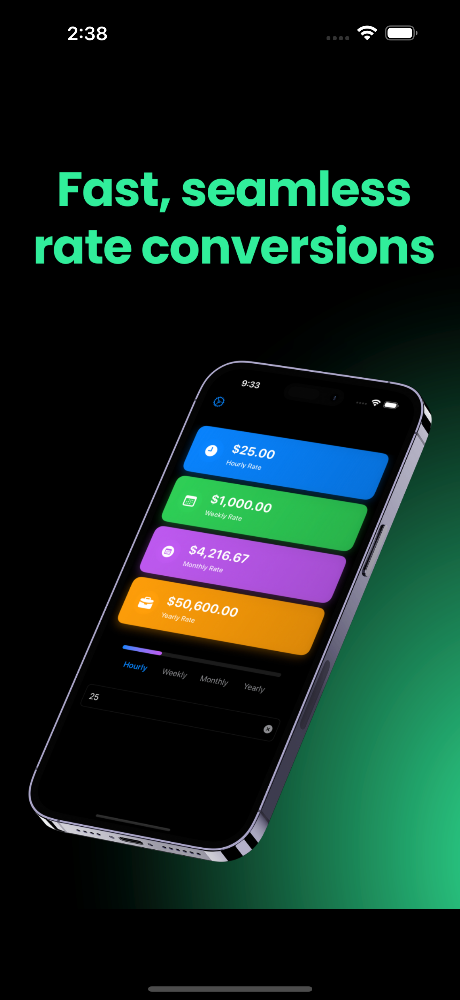

# My Apps

## [PayRate - Converter]()

        
        <h1><strong>PayRate Converter</strong></h1>
        

            <strong>PayRate Converter</strong> simplifies managing your earnings by allowing you to seamlessly convert between 
            <strong>hourly</strong>, <strong>weekly</strong>, <strong>monthly</strong>, and <strong>yearly</strong> pay rates. Perfect for freelancers, 
            consultants, and professionals, this app helps you understand and optimize your income with precision and ease.
        

        <h2>Key Features</h2>
        <ul>
            <li><strong>Instant Conversions:</strong> Switch between hourly, weekly, monthly, and yearly pay rates effortlessly.</li>
            <li><strong>Customizable Settings:</strong> Adjust work hours per week and vacation days for tailored calculations.</li>
            <li><strong>Clean and Intuitive Interface:</strong> Navigate easily with a user-friendly design.</li>
            <li><strong>Developer Info:</strong> Stay connected with support and updates directly from the developer.</li>
        </ul>
        

            Whether you're negotiating contracts, setting budgets, or curious about your earning potential, 
            <strong>PayRate Converter</strong> is the tool you need. Simplify your pay calculations and take control of your finances today!
        

    

 <a href="https://apps.apple.com/us/app/payrate-converter/id6740090591" 
       style="display: inline-block; 
              padding: 12px 20px; 
              font-size: 16px; 
              color: #fff; 
              background-color: #007bff; 
              text-decoration: none; 
              border-radius: 5px; 
              box-shadow: 0 4px 6px rgba(0, 0, 0, 0.1); 
              transition: background-color 0.3s ease, transform 0.2s ease;"
       onmouseover="this.style.backgroundColor='#0056b3'; this.style.transform='translateY(-2px)';"
       onmouseout="this.style.backgroundColor='#007bff'; this.style.transform='translateY(0px)';">
        Download the App
    </a>

