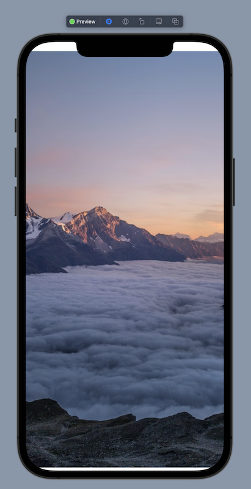
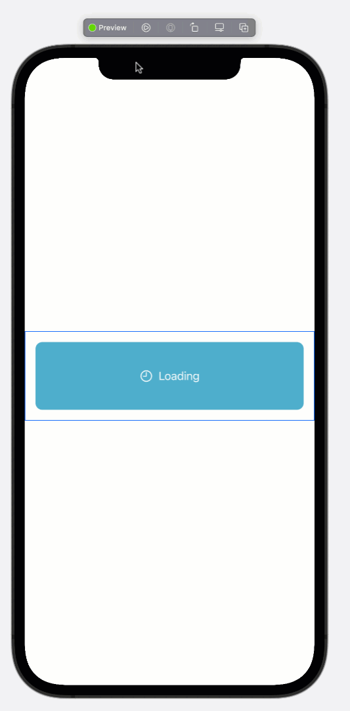

# Understanding AsyncImage in SwiftUI

At WWDC 2021, Apple unveiled tons of new SwiftUI features that will allow developers to create iOS apps even more fluently. One of the most anticipated features is the ability to display images using the Image view. In previous versions of SwiftUI, this was not possible and had to be implemented using custom code.
In iOS 15 and Xcode 13, Apple introduced AsyncImage, which allows you to download an image using just the URL. In this article, we will look at how to use AsyncImage in our SwiftUI applications.

---

### Implementation 

AsyncImage is pretty straightforward to use. Just supply with the URL of an image and you are done. This is shown in the implementation below:

``` swift 
struct LearnAsyncImage: View {
    
    let url = URL(string: "https://images.unsplash.com/photo-1506905925346-21bda4d32df4?ixid=MnwxMjA3fDB8MHxwaG90by1wYWdlfHx8fGVufDB8fHx8&ixlib=rb-1.2.1&auto=format&fit=crop&w=1350&q=80")!
    
    var body: some View {
        AsyncImage(url: url)
    }
}
```

The result is shown below: 



Pretty simple, right?

AsyncImage also provides the ability to add a placeholder view that is shown while the main image is being loaded. The placeholder view can be any view, but make sure it returns a View type. Here is a simple implementation of an AsyncImage using LoadingView as the placeholder view:

``` swift
struct LoadingView: View {
    var body: some View {
        HStack {
            Label("Loading", systemImage: "clock")
                .foregroundColor(.white)
        }.frame(maxWidth: .infinity, maxHeight: 100)
            .background(.teal)
            .clipShape(RoundedRectangle(cornerRadius: 10))
            .padding()
            
    }
}

struct LearnAsyncImage: View {
    
    let url = URL(string: "https://images.unsplash.com/photo-1506905925346-21bda4d32df4?ixid=MnwxMjA3fDB8MHxwaG90by1wYWdlfHx8fGVufDB8fHx8&ixlib=rb-1.2.1&auto=format&fit=crop&w=1350&q=80")!
    
    var body: some View {
        AsyncImage(url: url) { image in
            image
        } placeholder: {
            LoadingView()
        }

    }
}

```

The result is shown below:




AsyncImage does provide several other features that can help with the different loading states of an image. These states include:

- When the image is successfully loaded.
- When the image is being loaded.
- When the image failed to load.

The implementation is shown below:

``` swift 
struct LearnAsyncImage: View {
    
    let url = URL(string: "https://images.unsplash.com/photo-1506905925346-21bda4d32df4?ixid=MnwxMjA3fDB8MHxwaG90by1wYWdlfHx8fGVufDB8fHx8&ixlib=rb-1.2.1&auto=format&fit=crop&w=1350&q=80")!
    
    var body: some View {
        AsyncImage(url: url, scale: 1.0) { phase in
            if let image = phase.image {
                image
            } else if phase.error != nil {
                Text("Unable to load the image")
            } else {
                LoadingView()
            }
        }

    }
}
```

In the code above, we have used the AsyncImagePhase feature to check the different phases of downloading the image.

``` swift 
struct LearnAsyncImage: View {
    
    let url = URL(string: "https://images.unsplash.com/photo-1506905925346-21bda4d32df4?ixid=MnwxMjA3fDB8MHxwaG90by1wYWdlfHx8fGVufDB8fHx8&ixlib=rb-1.2.1&auto=format&fit=crop&w=1350&q=80")!
    
    var body: some View {
        AsyncImage(url: url, scale: 1.0) { phase in
            if let image = phase.image {
                image
            } else if phase.error != nil {
                Text("Unable to load the image")
            } else {
                LoadingView()
            }
        }

    }
}
```

In the phase closure, we check if we have access to the image. If we do, then we simply return it. If we have an error, then we return a View to be displayed for the error. And finally, we display LoadingView when the image is not yet loading and the error is also nil.

# Displaying Images in a List

AsyncImage can also be used to display images in a List view. Unfortunately, at this point, AsyncImage does not cache the images. This means the same image is downloaded again. Let’s check out some code:

``` swift 
struct Photo: Decodable {
    let id: Int
    let title: String
    let thumbnailUrl: String
}

private func loadPhotos() async throws -> [Photo] {
        
        // I am forced unwrapping but you should make sure to unwrap is safely
        let photosURL = URL(string: "https://jsonplaceholder.typicode.com/photos")!
        let (data, _) = try await URLSession.shared.data(from: photosURL)
        
        let photos = try? JSONDecoder().decode([Photo].self, from: data)
        return photos ?? []
    }
```

In the code above, loadPhotos uses the async/await feature of Swift to perform and wait for the async tasks. Once the request is made, the await makes sure that the thread is suspended and can be utilized for other jobs. Finally, the URLSession finishes downloading the resource and populates the photos array.
In the SwiftUI view, we call loadPhotos, as shown below:

``` swift 
var body: some View {
        
        List(photos, id: \.id) { photo in
            HStack {
                AsyncImage(url: URL(string: photo.thumbnailUrl)!)
                Text(photo.title)
            }
        }
        .task {
            async {
                self.photos = try await loadPhotos()
            }
        }

    }
```

The new task modifier allows us to execute the code when the view appears and then gets cancelled when the view disappears. Inside the task modifier, we call loadPhotos using the async closure and populate the photos.

> Note: To keep things simple, this article does not use any architectural patterns. In an actual app, you should use MVVM, MVC, or any other pattern so that your view is not directly making network calls.

The result is shown below:


# Conclusion 

AsyncImage is a welcome feature in SwiftUI that reduces the amount of custom code we have to write to download images. We hope that it will support even more capabilities — including caching — in the future.

**If you liked my article and want to support my work then consider checking out my courses on Udemy. I have many courses on iOS development, including SwiftUI, GraphQL, Vapor, Test Driven Development, MVVM and much much more.**

[Check out my Udemy courses](https://www.udemy.com/user/mohammad-azam-2/)