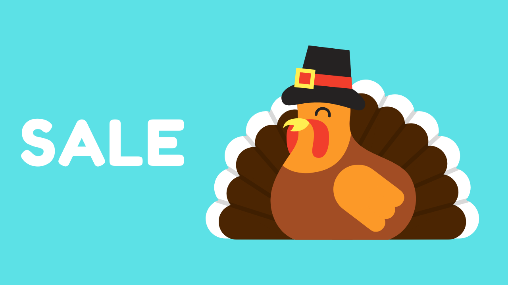

Hello Everyone, 

First of all “Happy Thanksgiving” to you. To celebrate this wonderful occasion, I am giving some of my best selling courses for a discounted price.

**Expires 11/30/2020**

[SwiftUI Declarative Interfaces for All Apple Devices](https://www.udemy.com/course/swiftui-declarative-interfaces-for-any-apple-device/?couponCode=THANKSGIVING) 

[The Complete Hands-On SwiftUI Apps Using Firebase](https://www.udemy.com/course/the-complete-hands-on-swiftui-apps-using-firebase/?couponCode=THANKSGIVING)

[Server Side Swift Using Vapor 4](https://www.udemy.com/course/server-side-swift-using-vapor-4-in-ios/?couponCode=THANKSGIVING) 

[MVVM Design Pattern in SwiftUI](https://www.udemy.com/course/mvvm-design-pattern-in-swiftui/?couponCode=THANKSGIVING) 

[Mastering RxSwift in iOS](https://www.udemy.com/course/mastering-rxswift-in-ios/?couponCode=THANKSGIVING) 

[The Complete Guide to Combine Framework in iOS](https://www.udemy.com/course/the-complete-guide-to-combine-framework-in-ios-using-swift/?couponCode=THANKSGIVING)

[The Ultimate Hands-On Flutter & MVVM - Build Real World Projects](https://www.udemy.com/course/flutter-dart-mvvm-design-pattern/?couponCode=THANKSGIVING)

I really hope you enjoy the courses! 

Have a very happy and safe Thanksgiving! 

Azam
