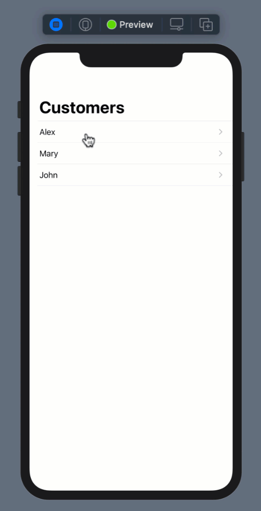
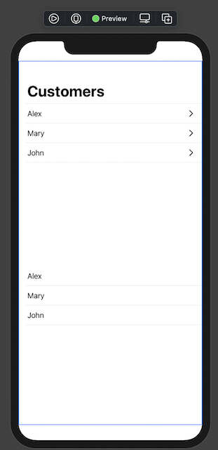

# Decoupling SwiftUI Views for Reusability

When designing SwiftUI applications it is extremely important to make sure that the views are decoupled and reusable. Tightly coupled views are harder to maintain, reuse and can result in future complications.
In this post, I will demonstrate how to implement decoupled views that can be reused in SwiftUI applications.

---

### Implementation

We will implement a simple scenario of master-detail view. The master view will display a list of customers and when a customer is selected, it will take the user to the detail screen and display the selected customer. One possible implementation is shown below:

``` swift 
NavigationView {
            VStack {
                
                List(customers, id: \.self) { customer in
                    NavigationLink(
                        destination: DetailView(customer: customer),
                        label: {
                            HStack {
                                Text(customer)
                                Spacer()
                                
                            }.contentShape(Rectangle())
                        })
                   
                }.listStyle(PlainListStyle())
                
            }
            .onAppear {
               // selectedCustomer = nil
            }
            
            .navigationTitle("Customers")
        }
```

Inside the List view, we used a NavigationLink which consists of the destination and the label. The label is used to display the view for the NavigationLink. The result is shown below:



The code works as expected but it is not reusable. If we want to display a list of customers in other parts of the application then we will have to copy/paste the code in several places. Not only copying and pasting is considered a bad practice but it has future implications. This means if you plan to update the code for displaying a list, then you will have to update it on multiple places.

One quick way to solve this problem is to extract out the list into its own component/view. This will allow us to pass an array of customers to the CustomerListView, which can then be displayed in the list. The implementation is shown below:

``` swift
import SwiftUI

struct CustomerListView: View {
    
    let customers: [String]
   
    
    var body: some View {
        
        List(customers, id: \.self) { customer in
            NavigationLink(
                destination: DetailView(customer: customer),
                label: {
                    HStack {
                        Text(customer)
                        Spacer()
                        
                    }.contentShape(Rectangle())
                })
           
        }.listStyle(PlainListStyle())
    }
}

struct CustomersView_Previews: PreviewProvider {
    static var previews: some View {
        CustomerListView(customers: ["John", "Mary", "Alex"]) 
    }
}

```

This allows you to use the CustomerListView in the ContentView as shown below:

``` swift

var body: some View {
        NavigationView {
            VStack {
                
                CustomerListView(customers: customers)
                
            }
           
            
            .navigationTitle("Customers")
        }
        
    }
```

Although this approach makes CustomerListView reusable, but it is still strongly coupled with the DetailView navigation. This means if a different view uses CustomerListView, it will still perform a navigation taking the user to the DetailView.

In order to fix this problem we have to allow the CustomerListView to give control to the caller. This allows the caller to decide where to navigate the user when the user selects a customer from the list.

In order to accomplish a complete decoupled solution, we need to pass a closure to CustomerListView. The closure is going to give caller the selected customer. And finally the caller can take action. CustomerListView implementation is shown below:

``` swift 
struct CustomerListView: View {
    
    let customers: [String]
    let onSelected: ((String) -> Void)?
    
    init(customers: [String], onSelected: ((String) -> Void)? = nil) {
        self.customers = customers
        self.onSelected = onSelected
    }
    
    var body: some View {
        
        List(customers, id: \.self) { name in
            HStack {
                Text(name)
                Spacer()
                 if onSelected != nil {
                    Image(systemName: "chevron.right")
                }
            }.contentShape(Rectangle())
            .onTapGesture(perform: {
                if let onSelected = onSelected {
                    onSelected(name)
                }
            })
           
        }.listStyle(PlainListStyle())
    }
}
```

As you can see in the above code, we passed a onSelected closure and then later we invoked the closure when the cell is tapped. The onSelected closure is optional, allowing the user to ignore the selection and only display the list of customers. The code below shows two different variations of using the CustomerListView. The first one is interested in the selected value, while the second one is only displaying a list of customers.

``` swift 
struct ContentView: View {
    
    let customers = ["Alex", "Mary", "John"]
    @State var selectedCustomer: String?
    
    var body: some View {
        NavigationView {
            VStack {
                    
                // get the selected customer
                CustomerListView(customers: customers) { (customer) in
                    selectedCustomer = customer
                }
                
                // only display the customers
                CustomerListView(customers: customers)
                
                
            }
            
            
            .navigationTitle("Customers")
        }
        
    }
}
```

The output is shown below:



The final part is to add navigation when the customer is selected. The caller (ContentView) can decide where to go after the value is selected. This is shown in the implementation below:

``` swift 

var body: some View {
        NavigationView {
            VStack {
                
                // get the selected customer
                CustomerListView(customers: customers) { (customer) in
                    selectedCustomer = customer
                }
                
                if let selectedCustomer = selectedCustomer {
                    NavigationLink(
                        destination: DetailView(customer: selectedCustomer),
                        isActive: .constant(true)) {
                        EmptyView()
                    }
                }
            }
            .onAppear {
                 selectedCustomer = nil
            }
            
            .navigationTitle("Customers")
        }
        
    }
```

Once the customer is selected, view is rendered again and we perform the Navigation using the NavigationLink.
This technique allows us to completely decouple our view with the navigation. Now our CustomerListView is 100% reusable and the caller can decide where the user will navigate upon selecting the customer.

Enjoy coding!

### Resources

- [Video - Decoupling SwiftUI Views for Reusability](https://youtu.be/JTSIb_atM1A)


<a href = "http://www.azamsharp.com/courses">
 
</a>


