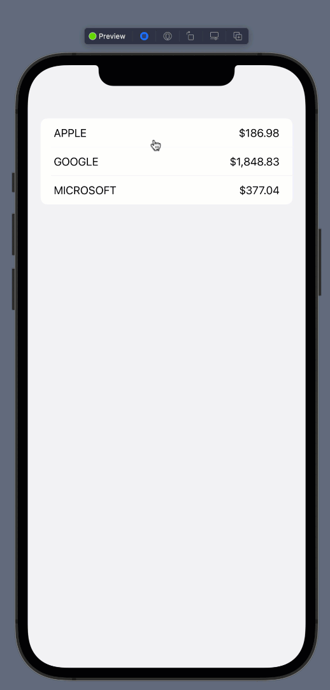

# Stocks App Using Async/Await, Pull To Refresh and Continuation in SwiftUI for iOS 15

Apple introduced tons of new features in Swift and SwiftUI. This includes Async/Await, Pull to Refresh, Continuation, Text Formatters etc. In this article, we are going to combine all the features together and build a stocks application.

# Stocks Service

For this article, we are not using a real stocks API. The stocks service we are going to implement will return hard-coded data with random prices. The implementation of getStocks function is shown below:

``` swift 
private func getStocks(_ completion: @escaping ([Stock]) -> Void) {
        DispatchQueue.main.asyncAfter(deadline: .now() + 2.0) {
            let stocks = [
                Stock(name: "APPLE", price: Double.random(in: 100...200)),
                Stock(name: "GOOGLE", price: Double.random(in: 1000...2000)),
                Stock(name: "MICROSOFT", price: Double.random(in: 300...500))
            ]
            completion(stocks)
        }
    }
```

As you can see the getStocks function takes in a completion closure, which is fired after 2.0 seconds. We used DispatchQueue.main.asyncAfter to simulate the delay in the network call. The stocks array is re-created again with different stock prices and then passed to the completion handler.

One important thing to note about the getStocks function is that it is private. If getStocks is private then how will the view model invoke this function.

Instead of using completion handlers, we are going to create our getStocks function as an async/await function. This means that the caller can await for our getStocks function. The implementation is shown below:

``` swift 
 func getStocks() async -> [Stock] {
        
        await withUnsafeContinuation { continuation in
            getStocks { result in
                continuation.resume(returning: result)
            }
        }
        
    }
```

The getStocks function is an async function, which returns an array of stock objects. The withUnsafeContinuation closure allows us to wait for the getStocks function result and then invoke the resume.

This completes our implementation of StockService. In the next section we are going to implement StockListViewModel, which will consume StockService to get all stocks and send it to the user interface.

# StockListViewModel

StockListViewModel is considered a container view model, which represents the entire stock list screen.

``` swift 
import Foundation

@MainActor
class StockListViewModel: ObservableObject {
    
    @Published var stocks: [StockViewModel] = []
    
    func getAllStocks() {
        
        async {
            let stocks = await StocksService().getStocks()
            self.stocks = stocks.map(StockViewModel.init)
        }
        
    }
    
}
```

First thing to notice is the property wrapper @MainActor decorated on the StockListViewModel class. The @MainActor represents that the @Published properties of StockListViewModel will be set on the main thread.

The getAllStocks function inside StockListViewModel is not marked with async, instead we used the async closure and await for the results from the StocksService.getStocks() function. Finally, we set the stocks property of StockListViewModel class which fires a subscription, letting user interface know to refresh itself.

# User Interface (View)

The user interface is pretty straight forward. We start by creating an instance of StockListViewModel and calling the getAllStocks inside the task closure. The task closure is fired when the view appears and then cancelled when the view disappears.

We also used refreshable, which is equivalent to pull to refresh in UIKit.

``` swift 
struct ContentView: View {
    
    @StateObject private var stockListVM = StockListViewModel()
    
    var body: some View {
        List(stockListVM.stocks, id: \.name) { stock in
            HStack {
                Text(stock.name)
                Spacer()
                Text(stock.price.formatted(.currency(code: "USD")))
            }
        }.task {
            stockListVM.getAllStocks()
        }.refreshable {
            stockListVM.getAllStocks()
        }
    }
}
```

The result is shown below:



Happy coding!

If you liked this article and want to support my work then check out my Udemy courses.

**If you liked my article and want to support my work then consider checking out my courses on Udemy. I have many courses on iOS development, including SwiftUI, GraphQL, Vapor, Test Driven Development, MVVM and much much more.**

<center>
<a href = "http://www.azamsharp.com/courses">
 
</a>
</center>
