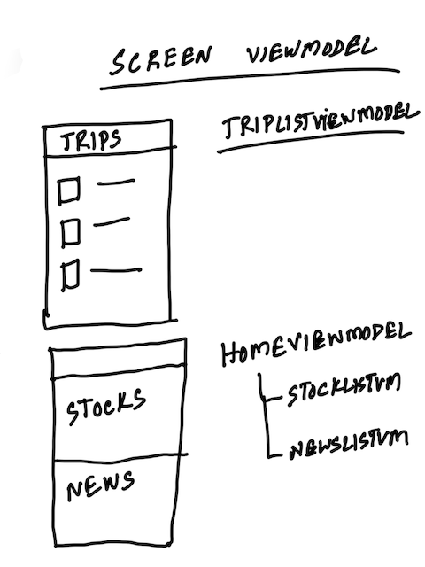
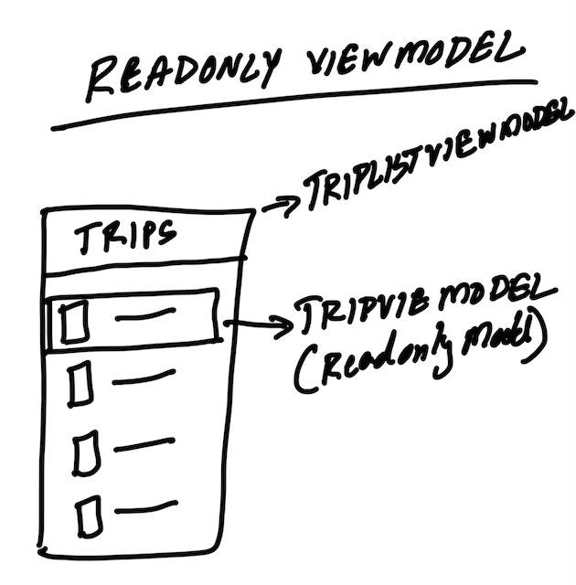
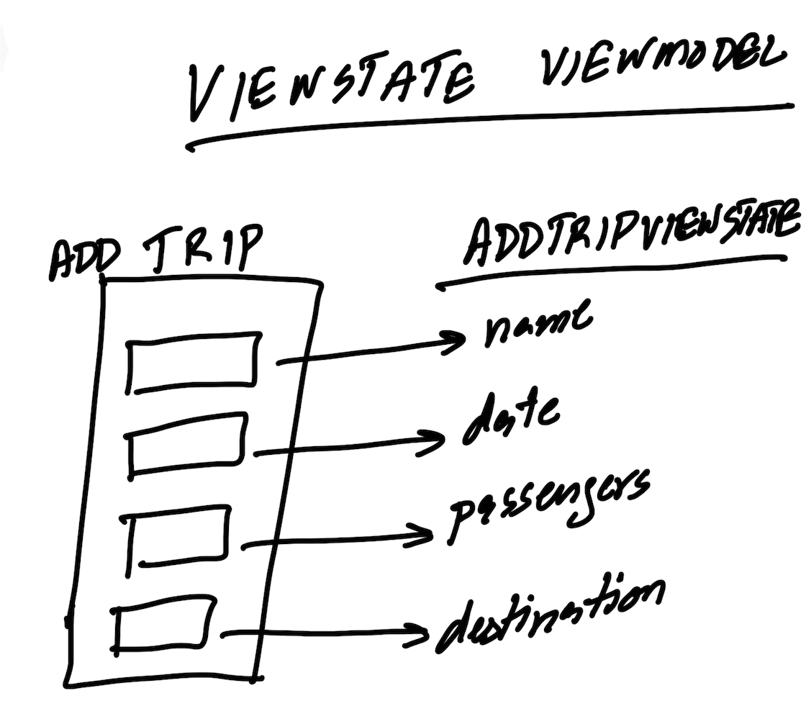

# ViewModel Patterns 

MVVM Design Pattern allows us to write clean, modular apps where each screen can be controlled by one parent ViewModel. In this post, I will go over several common ViewModel patterns when implementing apps using MVVM pattern. 

### Screen ViewModel

The Screen ViewModel represents an entire screen of the app. It can also consists of child ViewModels, which may represent separate parts of the screen. Here is an illustration of sample usage for Screen ViewModel pattern.    



``` swift
class TaskListViewModel: ObservableObject {
    
    @Published var tasks = [TaskViewModel]()
    .. code continued 
```

### ReadOnly ViewModel 

The ReadOnly ViewModel pattern is used to provide the View with read only information. The information is usually extracted from a model object and then exposed to the view as ViewModel properties. The main purpose ReadOnly ViewModel is to format the information, which matches the View requirements. 




In the illustration above we are using Screen ViewModel, as well as ReadOnly child ViewModel. The purpose of TripViewModel (ReadOnly) is to extract the information from the model and present it on the view. TripViewModel controls the data presented for each trip, while TripListViewModel controls everything that happens on the screen and may also contain behaviors. 

Here is an extremely simple example of TaskViewModel, which is later used by TaskListViewModel. 

``` swift 
struct TaskViewModel {
    
    let task: Task
    
    var title: String {
        task.title
    }
    
    var taskId: String {
        task.taskId ?? ""
    }
}

class TaskListViewModel: ObservableObject {
    
    @Published var tasks = [TaskViewModel]()

    ... code continued 
}

```

### ViewState ViewModel 

The ViewState ViewModel is responsible for collecting information from the View and populating the ViewModel. 



After populating the ViewState ViewModel, it can be used by Screen ViewModel to transfer the data to the Model and then eventually to the persistence layer. 

``` swift
struct TaskViewState {
    var title: String = ""
}
```

Here is the usage in ContentView: 

``` swift
 @State private var taskVM = TaskViewState()

  TextField("Title", text: $taskVM.title, onEditingChanged: { _ in }, onCommit: {
                
               ... call the save
                
            }).textFieldStyle(RoundedBorderTextFieldStyle())
```

### ViewState to Model 

After populating your ViewState with user's input you need to convert it to model before it can be persisted. Here is a simple pattern you can use to make that conversion. 

``` swift
extension Task {
    
    static func from(_ taskVM: TaskViewState) -> Task {
        return Task(title: taskVM.title)
    }
    
}
```

I believe that the declarative frameworks like SwiftUI, Flutter and React can take advantage of MVVM Pattern to construct better and more maintainable apps.  

<center>
<a href = "http://www.azamsharp.com/courses">
 
</a>
</center>